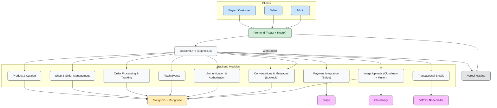
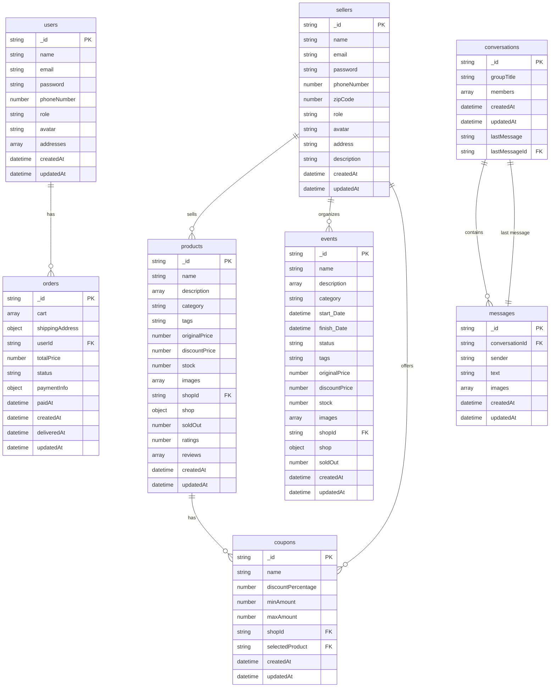
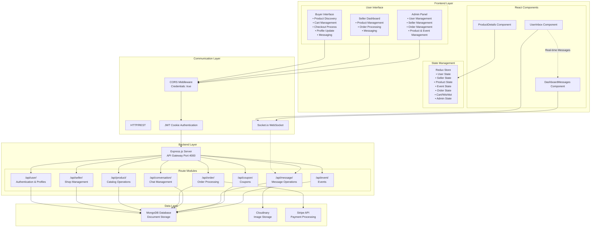
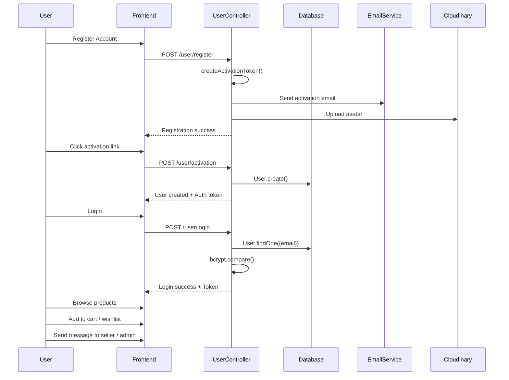
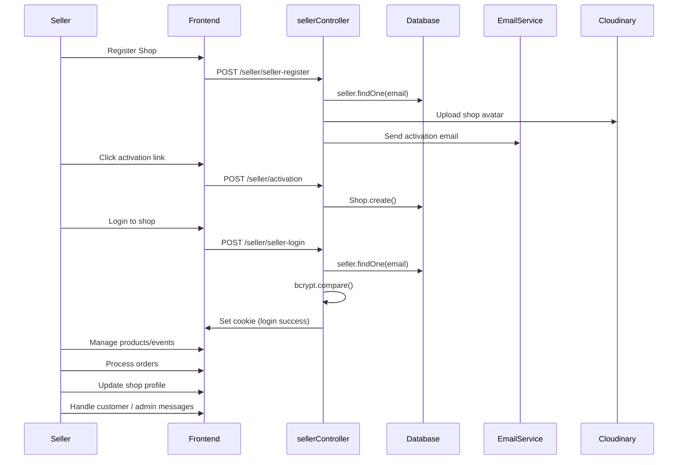
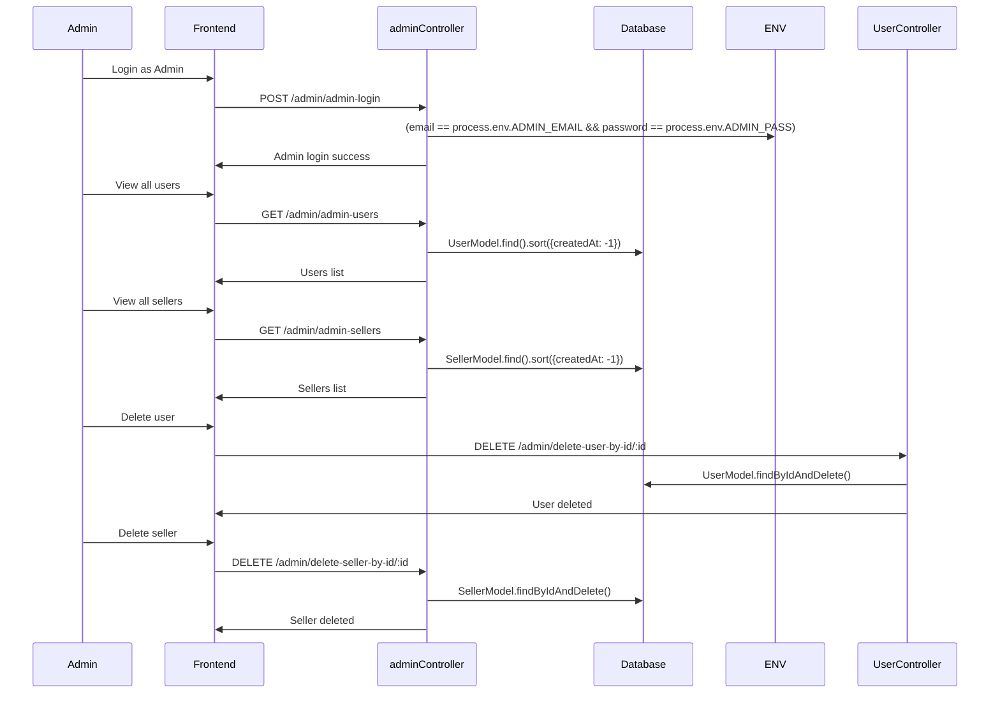

# Case Study - Multi-Vendor E-commerce Platform

## Overview

Meet **Zenvio**.

**Name meaning:**
- **Zen** = smooth, effortless experience
- **vio** = via/through, connecting buyers and sellers

As per its name, it is a multi-vendor e-commerce platform where buyers can find their favorite products and can connect with its respective seller.

## Goals of the Project

The goal of this platform is to provide a marketplace where buyers can find the products according to their taste and seller can sell products seamlessly. A marketplace where the payment transactions are secure n safe and users can contact with each other.

## System Architecture Overview

### System Architecture Diagram

---

## Key Features

### Multi-Role User System

This platform provide 3 main User roles according to the marketplace.

- **Buyer**: Saving products, Add to cart, messaging, order tracking
- **Seller**: Product management, Order status tracking, messaging
- **Admin**: Panel to keep track of Buyers, Sellers, Products, Orders, Events and messaging.

### Product Management & Shopping

- **Product listings**: A grid-based product listing with support of backward navigation links **Breadcrumb** in Product Details page.
- **Cart & checkout**: A safe Cart component to keep track of items along with secure checkout procedure featuring Cash-on-Delivery and Stripe payment gateway.
- **Search & filtering**: A fast & robust search bar with a sections displays matching product names which is support by Category-based filter.

### Payment Processing

- **Secure transactions**: Integrated secure payment process for Stripe account done by integrating Checkout sessions and Web-hook.

### Real-Time Messaging

- **Buyer ↔ Seller ↔ Admin Chat**: This market place allow one-to-one chatting between Buyer ↔ Seller, Buyer ↔ Admin and Seller ↔ Admin.
- **Online Status**: Integrated green dot based online status signaling which is active on the platform at the moment.

### Seller Dashboard Features

- **Dashboard**
  - Seller can see the overview of the shop in dashboard
- **Product Management**
  - Seller can see all products and all flash-events products.
- **Order Management**
  - Seller can track all orders + change the order status.
- **Discount Codes**
  - Seller can add discount by creating a coupon code for any specific product.
- **Refunds**
  - Seller can accept the Refund request by user and apply it on specific order.
- **Shop Update**
  - Seller can update the profile and shop details.
- **Chatting**
  - Seller can engage with both buyers and Admin.

### API Architecture

**Buyer Auth and profile**
- `/api/user`

**Seller Auth and profile**
- `/api/seller`

**Messages & Conversations**
- `/api/conversation`
- `/api/message`

**Product Management**
- `/api/product`
- `/api/event`
- `/api/coupon`

**Order Management**
- `/api/order`

**Admin Panel**
- `/api/admin`

### Brand Value Propositions

- **Scalability**: The market place can be scale for more categories products and payment methods.
- **Security**: Accepts only HTTP cookies to prevent XSS attacks.
- **Performance**: Uses global state management & SEO practices to maintain the website performance.

## Tech Stack

### Backend

**Frameworks & libraries**
- **Node.js**: For creating & running JavaScript in local setup
- **Express.js**: Light Node.js framework for backend logic.
- **MongoDB**: NOSQL database for storing data into scalable document.
- **JWT**: Secure user authentication & authorization based on tokens set in cookies.
- **Bcrypt**: Use for hashing passwords before storing to database.
- **Node Mailer**: A package use to send emails.
- **Stripe**: Payment gateway for secure transactions

### Frontend

**Frameworks & libraries**
- **React with Tailwind CSS**: For UI Designing.
- **Redux Toolkit**: For Global state management.
- **Socket Client**: For integrating socket chat feature in frontend.
- **Vite**: Light-weight frontend app package for dev servers

### File & Media Handling

- **Image uploads**: Handle by Cloudinary cloud storage with feature to delete old images before updating the profile.
- **Cloud storage**: Handles by Multer's storage manager.

### Real-Time Communication

- **SocketIO**: SocketIO server manages real-time chatting along with image upload feature to Cloudinary.

### Development & Deployment Tools

- **Dotenv**: Uses env environmetal variables to store private API keys and credentials.
- Uses Express server with nodemon to automatically restart server after saving a file in local machine.
- **Vercel** cloud platform to upload client-side UI and backend servers.

## Challenges & Solutions

| Challenge | Solution |
|---|---|
| Image Uploading | Use local folder firstly, then integrate Cloudinary to upload images to desired location. |
| Redux State Reset | Call Actions inside React useEffect hook to load data in App.jsx and to necessary file to ensure data remains save. |
| Send Data and Model Mismatch | Correctly write queries to store data that matches the database model. |

## Database Design

---

## Application Flow Diagram

---

### User Flow

---

### Seller Flow

---

### Admin Flow

---

## Best Practices

### Authentication & Security

- **JWT**: Implemented HTTP only cookies to prevent XSS attacks.
- **Data encryption**: Implemented password hashing to prevent credential exposure.
- **Role Based Authentication**: Implemented Private routes with role based authentication for smooth workflow and prevents un-necessary redirection.

### Component Architecture

- **Reusable components**: Used re-usable React components to main Folder structure easy to read and maintain.
- **State Management**: Implemented redux reducers and actions for clean data management all across the website.
- **Protected Routes**: Implement protected routes for all Users (Buyers, Sellers & Admin) to prevent un-necessary navigation.

### Error Handling & User Experience

- **Friendly error messages**: Integrated React-Hot-Toast to display user friendly error messages.
- **Logging & monitoring**: Implemented logic to prevent duplicates across sections like Cart and Wish-list for smooth User Experience.